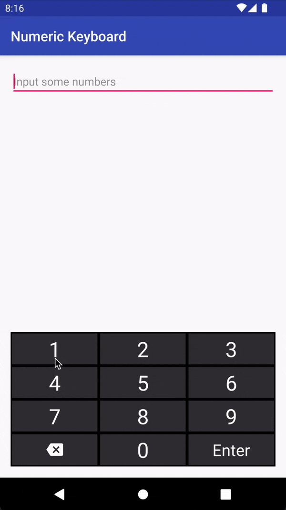

# Numeric Keyboard
[](https://jitpack.io/#karlguzman/NumericKeyboard)
[](https://github.com/konaire/NumericKeyboard/blob/master/LICENSE.txt)

   

## Description
It's a simple numeric keyboard which user can't hide. This keyboard prevents focusing on your `EditText` and you won't see the default keyboard anymore. It supports main features of the android keyboard and can be customized in many different ways.

Library was written in Kotlin. So it will perfectly match with your new awesome project :wink:

## Installation
The Gradle dependency is available via  [](https://jitpack.io/#karlguzman/NumericKeyboard). The minimum API level is 15 (Android 4.0).

**Step 1.** Add the JitPack repository to your build file:
  ```java
allprojects {
		repositories {
			...
			maven { url 'https://jitpack.io' }
		}
	}
```
**Step 2.** Add the dependency
```java  
dependencies {  
	// other dependencies here implementation 
	implementation 'com.github.karlguzman:NumericKeyboard:{TAG}'
}
```  

## Usage
### From layout resource
You can set background, width, margin, etc from android xml attributes:\  
**app:field** - reference to the `EditText` which will take user input\  
**app:fieldMaxLength** - `maxLength` of the bound `EditText`, if it has one\  
**app:keyHeight** - height for all keyboard's keys\  
**app:keyTextColor** - text color of a key\  
**app:keyTextSize** - text size of a key\  
**app:keySpecial** - right bottom key on the keyboard (disabled by default, see details in javadoc)  
**app:keySpecialTextSize** - text size of a key\

_Note:_ If your `EditText` has **android:maxLength** attribute but you haven't provide **app:fieldMaxLength** for the keyboard, a `TextWatcher` for that `EditText` will be called even when user taps on a key after reaching the max length.

In the following example keyboard was initialized from the layout.

```xml  
<FrameLayout  
    xmlns:android="http://schemas.android.com/apk/res/android"
    android:layout_width="match_parent"
    android:layout_height="match_parent">

    <EditText
        android:id="@+id/code"
        android:layout_width="match_parent"
        android:layout_height="wrap_content"
        android:hint="@string/hint"
        android:inputType="number"
        android:textColor="@android:color/black"
        android:textSize="@dimen/text_size" />

 <!-- Some other stuff -->  

    <com.konaire.numerickeyboard.NumericKeyboard
        android:layout_width="match_parent"
        android:layout_height="wrap_content"
        android:layout_gravity="bottom"
        android:layout_marginBottom="@dimen/gap"
        app:field="@+id/code"
        app:keyTextColor="@color/green" />
</FrameLayout>
```  

### From code
Also you can set all custom parameters from the code. There is an example:

```kotlin  
// other imports  
import kotlinx.android.synthetic.main.activity_main.*  
  
class MainActivity: AppCompatActivity() {  
    override fun onCreate(savedInstanceState: Bundle?) {
        super.onCreate(savedInstanceState)
        setContentView(R.layout.activity_main)

        keyboard.field = field
        keyboard.fieldMaxLength = 10
        keyboard.keyTextColor = Color.GREEN
    }
}
```  

# License
The library is distributed under the [MIT LICENSE](https://github.com/karlguzman/NumericKeyboard/blob/master/LICENSE.txt).
